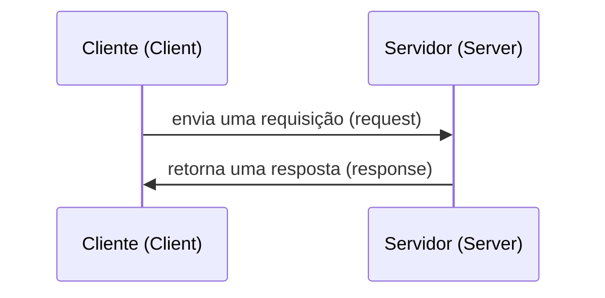

# Requisições HTTP

## O que são requisições HTTP?

Uma requisição HTTP é uma ação a ser realizada em um recurso (resource) identificado por uma URL.

### Partes de uma URL

| URL                              | Protocolo | Domínio           | Porta | Pasta   |
|----------------------------------|:---------:|:-----------------:|:-----:|---------|
| https://localhost/product        | https     | localhost         | 80    | product |
| http://filipefonseca.com/profile | http      | filipefonseca.com | 80    | profile |
| https://google.com               | https     | google.com        | 80    | (raiz)  |
| ftp://localhost:9090/image       | http      | localhost         | 9090  | image   |

- **http**  = Hypertext transfer protocol
- **https** = Hypertext transfer protocol secure
- **ftp**   = File transfer protocol

## Fluxo de uma chamada HTTP



## Partes de uma requisição (request)

### Método (HTTP Method)

- GET: Obter, pegar
- POST: Criar
- PUT: Atualizar
- DELETE: Deletar

### Destino da requisição (Request target)

É uma URL. Pode ser absoluta ou relativa.

- Absoluta: https://filipefonseca.com/api
- Relativa: /api

Pode ter ou não parâmetros.

- Sem parâmetros: https://filipefonseca.com/api/image
- Com parâmetros: https://filipefonseca.com/api/image?name=Nome-da-imagem&category=categoria-da-imagem

### Cabeçalho (Headers)

Um conjunto de estruturas de chave-valor:

Content-Type: application/json
User-Agent: Mozilla/5.0 (Windows NT 6.1; Win64; x64; rv:47.0) Gecko/20100101 Firefox/47.0

### Corpo (Body)

Nem toda requisição possui um body. O conteúdo pode ter vários formatos, por exemplo uma string ou um json.
```json
{
    "name": "Filipe Fonseca",
    "contacts": [
        "11987654321",
        "1142365855"
    ],
    "attributes": {
        "height": 1.71,
        "weight": 70
    }
}
```

## Partes de uma resposta (response)

### Código do status (status code)

(ver: https://developer.mozilla.org/pt-BR/docs/Web/HTTP/Status)

1. Respostas de informação (100-199),
2. Respostas de sucesso (200-299),
3. Redirecionamentos (300-399)
4. Erros do cliente (400-499)
5. Erros do servidor (500-599).

### Cabeçalho (Headers)

(idem)

### Corpo (body)

(idem)

# Exercícios

1. Fazer uma requisição GET para a URL https://filipefonseca.com/api/workshop. Qual o status code? Qual o body?

2. Fazer uma requisição GET para a URL https://filipefonseca.com/api/works. Qual o status code? Qual o body?

3. Fazer uma requisição GET para a URL https://filipefonseca.com/api/workshop passando o seu nome no parâmetro `name`. Qual o status code? Qual o body?

4. Fazer uma requisição GET para a URL https://filipefonseca.com/api/workshop passando um id entre 1 e 5 no parâmetro `id`. Qual o status code? Qual o body?

5. Fazer uma requisição POST para a URL https://filipefonseca.com/api/workshop passando um objeto com qualquer valor dentro no body da requisição. Qual o status code? Qual o body?

6. Fazer uma requisição POST para a URL https://filipefonseca.com/api/workshop passando um objeto com qualquer valor dentro no body da requisição e o header Content-Type com o valor application/json. Qual o status code? Qual o body?

